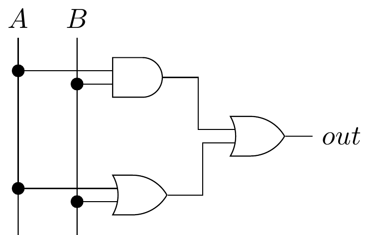

# TP1 - Portes et circuits logiques (2/3)

*Lors du cours magistral vous avez abordé les fonctions booléennes tel que la fonction OR, AND ou encore NOT. Lors de ce TP, vous allez manipuler ces fonctions ainsi que leur représentation graphique. Nous allons apprendre à combiner des portes logiques pour en former de nouvelles.*

- [TP1 - Portes et circuits logiques (2/3)](#tp1---portes-et-circuits-logiques-23)
  - [Question](#question)


## Question

Trouvez la table de vérité correspondant au circuit suivant :



```text
A | B | out
-----------
0 | 0 | ?
0 | 1 | ?
1 | 0 | ?
1 | 1 | ?
```

<details>
<summary>Correction</summary>

```text
A | B | out
-----------
0 | 0 | 0
0 | 1 | 1
1 | 0 | 1
1 | 1 | 1
```

</details>
