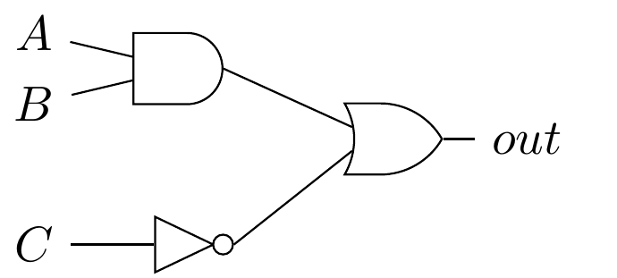
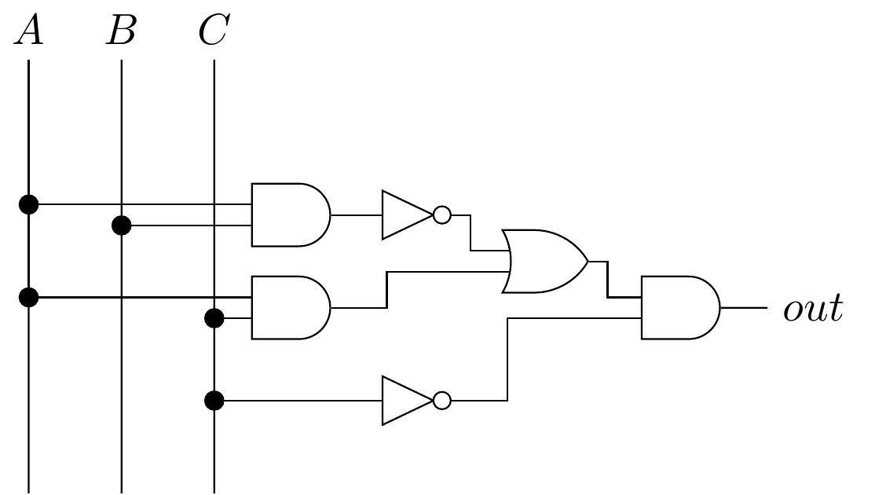

# TP1 - Portes et circuits logiques (3/3)

*Lors du cours magistral vous avez abordé les fonctions booléennes tel que la fonction OR, AND ou encore NOT. Lors de ce TP, vous allez manipuler ces fonctions ainsi que leur représentation graphique. Nous allons apprendre à combiner des portes logiques pour en former de nouvelles.*

- [TP1 - Portes et circuits logiques (3/3)](#tp1---portes-et-circuits-logiques-33)
  - [Question 1](#question-1)
  - [Question 2](#question-2)
  - [Question 3](#question-3)


## Question 1

Nous pouvons combiner les portes logiques construites dans les exercices précédents pour obtenir un circuit logique. Proposez une table de vérité décrivant le circuit suivant :



Cette table devra avoir le format suivant :

```text
A | B | C | out
--------------
0 | 0 | 0 | ?
0 | 0 | 1 | ?
0 | 1 | 0 | ?
0 | 1 | 1 | ?
1 | 0 | 0 | ?
1 | 0 | 1 | ?
1 | 1 | 0 | ?
1 | 1 | 1 | ?
```

<details>
<summary>Correction</summary>

```text
A | B | C | out
--------------
0 | 0 | 0 | 1
0 | 0 | 1 | 0
0 | 1 | 0 | 1
0 | 1 | 1 | 0
1 | 0 | 0 | 1
1 | 0 | 1 | 0
1 | 1 | 0 | 1
1 | 1 | 1 | 1
```

</details>

## Question 2

Etudions un circuit plus complexe, trouvez la table de vérité du circuit suivant :



<details>
<summary>Correction</summary>

```text
A | B | C | out
--------------
0 | 0 | 0 | 1
0 | 0 | 1 | 0
0 | 1 | 0 | 1
0 | 1 | 1 | 0
1 | 0 | 0 | 1
1 | 0 | 1 | 0
1 | 1 | 0 | 0
1 | 1 | 1 | 0
```

</details>

## Question 3

Trouvez une formule booléenne produisant la même table de vérité que le circuit étudié précédemment :


Vous avez accès aux portes NAND, NOR, XOR, NOT, AND et OR.

Exemple : AND(C,NOT(XOR(A,B)))

Pour cet exercice, il y a plusieurs possbilité, vous pouvez par exemple essayer de n'utiliser que les portes NOT et NAND.

<details>
<summary>Correction</summary>

```text
AND(NOT(C),OR(NAND(A,B),AND(A,C)))
```

</details>
