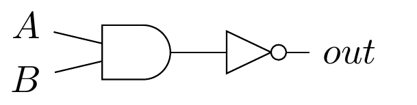
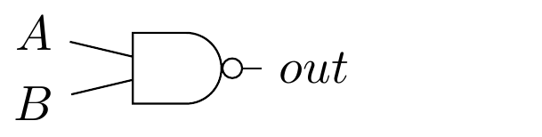
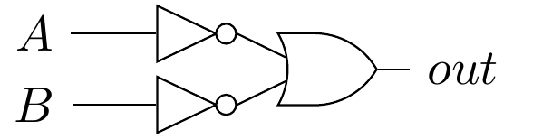
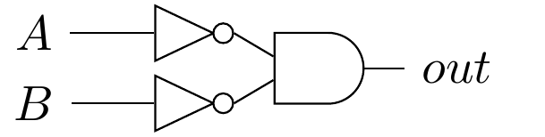
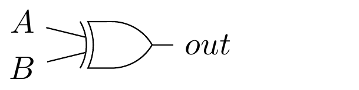
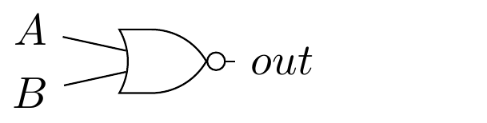

# TP1 - QCM

*Cet exercice a pour but de vérifier votre compréhension de la représentation graphique des portes logiques, des lois de De Morgan ainsi que des règles d'associativité et de commutativité. Si vous n'êtes pas à l'aise avec ces concepts, nous vous conseillons de relire le syllabus.*

- [TP1 - QCM](#tp1---qcm)
  - [Question 1: Portes logiques](#question-1-portes-logiques)
  - [Question 2](#question-2)
  - [Question 3](#question-3)
  - [Question 4](#question-4)

## Question 1: Portes logiques

Soit le circuit logique suivant,

lequels des circuits ci-dessous y est équivalent? Cochez toute les bonnes réponses.

- [x] 
- [x] 
- [ ] 
- [ ] 
- [ ] 

## Question 2

Même question pour le circuit suivant

- [ ] 
- [ ] 
- [x] 
- [ ] 
- [x] 
- [ ] 

## Question 3

Parmis les formules booléens ci-dessous, lesquelles sont identique à `NOT(AND(A,B))` ?

- [ ] `AND(NOT(A),B)`
- [ ] `AND(A,NOT(B))`
- [ ] `AND(NOT(A),NOT(B))`
- [x] `OR(NOT(A),NOT(B))`

Explication

`NOT(AND(A,B))` est équivalent à `NAND(A,B)`. La fonction `NAND` est équivalente à `OR(NOT(A),NOT(B))`.

## Question 4

Même question pour l'expression : `AND(A,AND(B,C))`

- [x] AND(AND(A,B),C)
- [ ] AND(A,OR(B,C))
- [x] AND(C,AND(B,A))
- [ ] OR(A,OR(B,C))
