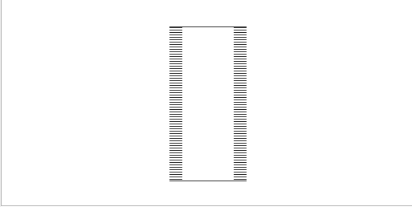
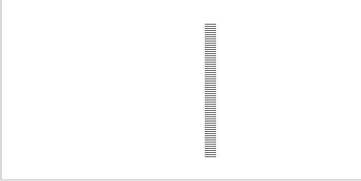
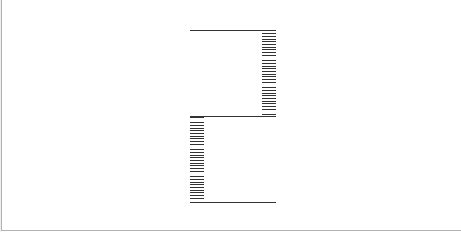
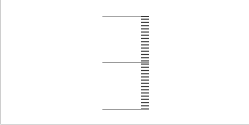
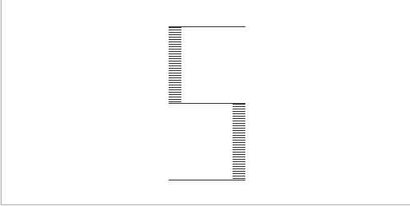
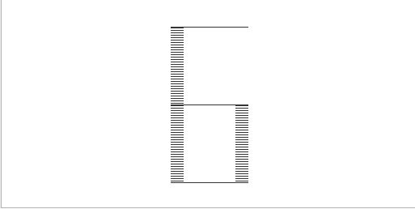
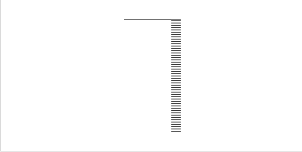
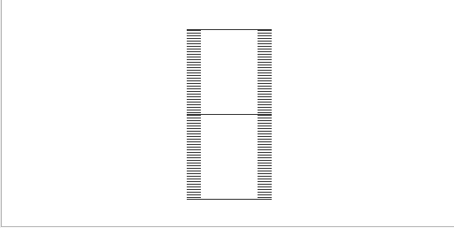
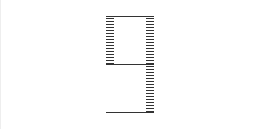

# digital-led-style-input (LINFO1140)

- [digital-led-style-input (LINFO1140)](#digital-led-style-input-linfo1140)
  - [CPU Emulator Settings](#cpu-emulator-settings)
  - [How To Use](#how-to-use)
  - [Screenshots](#screenshots)

## CPU Emulator Settings

- Program speed: Fastest
- Animate: No animation

## How To Use

The program except numeric values.
You can just tap a number on your keyboard (0-9).
Then the program while display it

## Screenshots

